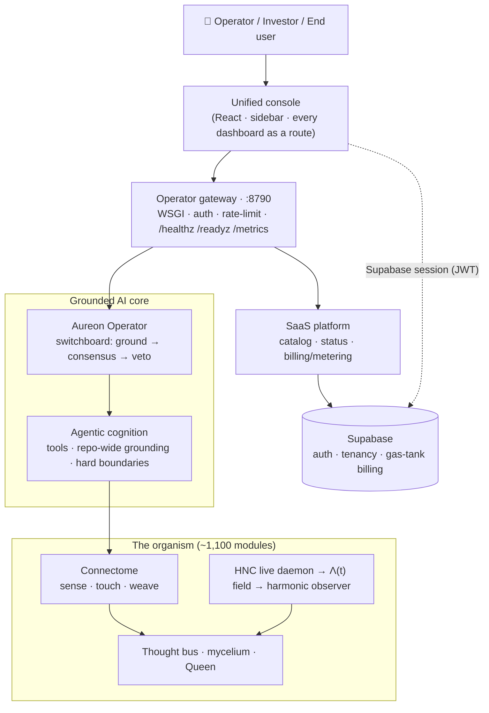

<div align="center">


# Aureon OS

### — Harmonic Nexus Core —

**The operating system for evidence-heavy, high-control work: a grounded AI operating layer.**
Trading research · autonomous operator · planetary/HNC research · a coding organism — one auditable system.


[](LICENSE)


*A product of [R&A Consulting and Brokerage Services Ltd](COMPANY.md) — trading as **Aureon Zorza Technologies** · Belfast, Northern Ireland · Silver-level Innovate NI innovator.*

</div>

---

## What Aureon OS is

Aureon OS is a **local-first operating layer** — powered by the Harmonic Nexus Core — that
lets a human operator run, inspect, and
ground evidence-heavy automation across several domains from one place. It is built to be
*auditable first*: code, ledgers, audits, generated interfaces, and research artifacts are
kept together so a reviewer can always see what exists, what is experimental, and what is
ready for controlled use.

It is delivered in three honest layers — each real, each independently reviewable:

1. **The production platform** — the engineering you can run today.
2. **The research framework (HNC)** — pre-registered, falsifiable hypotheses with evidence.
3. **The vision** — the thread that ties the ancient, the mathematical, and the market together.

> This is the formal front door. The original long-form README is preserved unchanged at
> [`docs/archive/README_legacy_20260712.md`](docs/archive/README_legacy_20260712.md) — nothing was removed, only formalized.

### How it fits together



<sub>Every consequential action passes a hard authority boundary + conscience veto before it runs; the platform never trades, pays, or files autonomously.</sub>

---

## 1 · The production platform (what runs today)

| Capability | What it is | Entry point |
|---|---|---|
| **Aureon Operator** | A grounded AI switchboard — routes a prompt through many models, grounds it in the repo, reaches consensus, and applies a conscience veto before answering. | [`aureon/operator/`](aureon/operator/) · [switchboard doc](docs/architecture/AUREON_OPERATOR_SWITCHBOARD.md) |
| **Agentic cognition** | The operator as an agent: repo-wide grounding, tool use (search / read / code / state), hard authority boundaries enforced before any action. | [`aureon/operator/cognition.py`](aureon/operator/cognition.py) |
| **The organism connectome** | The metacognitive layer that senses, touches, and weaves every module of the body — legacy code included — into one living system. | [`aureon/core/aureon_connectome.py`](aureon/core/aureon_connectome.py) · [doc](docs/architecture/ORGANISM_CONNECTOME.md) |
| **SaaS platform** | A categorized catalog of ~1,100 modules, honest health status, a tenancy bridge, and a billing/metering layer, served behind one gateway. | [`aureon/saas/`](aureon/saas/) · [SAAS_PLATFORM.md](docs/SAAS_PLATFORM.md) |
| **Unified console** | One professional React interface — sidebar, command palette, every dashboard as a route — over the whole repo. | [`frontend/`](frontend/) |
| **Production hardening** | WSGI serving, `/healthz` `/readyz` `/metrics`, bearer auth + rate limiting, Docker, a two-tier lint/type gate, CI. | [PRODUCTION_GRADE.md](docs/runbooks/PRODUCTION_GRADE.md) |
| **Multi-user platform** | End-user sign-in with **per-user encrypted keys**, each user reasoning on their own models, and a default-deny boundary between a signed-in user's account and the instance's control plane. | [`aureon/operator/identity.py`](aureon/operator/identity.py) · [MULTI_TENANT_AUTH.md](docs/architecture/MULTI_TENANT_AUTH.md) |

<div align="center">


</div>

### Quickstart

```bash
# 1 · the grounded operator (offline-safe; add model keys to go live)
pip install -e '.[operator]'
python -m aureon.operator.operator_server        # serves :8790 — /healthz, /api/cognition/reason

# 2 · the full platform (console + gateway) via Docker
docker compose -f deploy/docker-compose.saas.yml up --build

# 3 · run the strict-tier test suite (offline, no keys/network)
AUREON_LLM_OFFLINE=1 pytest tests/test_operator_*.py tests/test_saas_*.py tests/test_connectome.py -q
```

### Full local test with live keys

Everything that makes Aureon run is in this repo; the only things it cannot carry are **your**
credentials and the optional heavy renderers. To prove the whole system on your own disk:

```bash
git clone https://github.com/RA-CONSULTING/Aureon-OS && cd Aureon-OS
pip install -e '.[operator]'
pip install reportlab opencv-python-headless websocket-client pypdf   # optional: PDF/video artifacts, Binance WS, statement parsing
```

Then put your keys in `.env` at the repo root (loaded via `python-dotenv`; encrypted-at-rest
`hncqp1:` values are supported when `AUREON_HNC_PACKET_MASTER_KEY` is set):

```bash
# exchanges — each venue activates only when its pair is present
BINANCE_API_KEY=… / BINANCE_API_SECRET=…
KRAKEN_API_KEY=…  / KRAKEN_API_SECRET=…
ALPACA_API_KEY=…  / ALPACA_SECRET_KEY=…
CAPITAL_API_KEY=… / CAPITAL_IDENTIFIER=… / CAPITAL_PASSWORD=…

# safety posture — the defaults keep first boot honest
BINANCE_USE_TESTNET=true   BINANCE_DRY_RUN=true    # flip to false only when you mean it
AUREON_OBSERVER_MODE=live                          # live is the default; dry_run/shadow for a softer first run
```

Missing keys are never guessed around: a venue without credentials reports `no_data` with a named
blocker, dormant features stay visibly dormant, and live-mutation surfaces (Azyra desktop typing,
outbound admin email, real orders) each sit behind their own explicit gate documented alongside the
feature. The full boot sequence, per-daemon checklist, and every listener with the env var that
closes it are in [`docs/QUICK_START.md`](docs/QUICK_START.md),
[`docs/LIVE_TRADING_RUNBOOK.md`](docs/LIVE_TRADING_RUNBOOK.md), and
[`docs/runbooks/GO_LIVE_HARDENING.md`](docs/runbooks/GO_LIVE_HARDENING.md).

### Running it for more than one person

Aureon starts as a **single-operator** system and stays exactly that until you configure otherwise —
every control below is off by default, so nothing changes for a local or personal instance.

Set `AUREON_SUPABASE_JWT_SECRET` and it becomes multi-user, with a hard line down the middle:

| | The operator | A signed-in end user |
|---|---|---|
| **Keys** | the instance's own, in `os.environ` + the global keystore | **their own**, Fernet-encrypted in an isolated per-account store, masked to last-4 on read, never written into the process environment |
| **Reasoning** | the instance engine, full toolbelt | **their own models**, on a request-scoped engine with a pure-compute toolbelt — no shell, no repo write, no network egress, no instance-state read |
| **Memory** | the shared thought bus and mesh | isolated: their prompts and answers never enter shared instance memory |
| **Control plane** | theirs — switchboard, host actions, approvals, manifests, MCP, instance credentials | **refused**. A tenant reaches an explicit allowlist; every other `/api` route is operator-only by omission |

The boundary is enforced **once, centrally, default-deny** — not per route. That decision came from
being wrong three times: three rounds of adversarial audit each found the same class of hole, a guard
on a write route with the matching read route still serving. The 64 routes are mounted by five
different registrars, so no file lists them all and no reviewer sees them all; the request gate does.
A route added tomorrow is closed to end users by construction.

Each round's findings, the reproductions, and what was deliberately *not* fixed are written up in
[`docs/architecture/MULTI_TENANT_AUTH.md`](docs/architecture/MULTI_TENANT_AUTH.md). Before exposing an
instance to a network, read
[`docs/runbooks/GO_LIVE_HARDENING.md`](docs/runbooks/GO_LIVE_HARDENING.md) — it names every listener,
what each one serves, and the env var that closes it.

```bash
# multi-user mode (all optional; unset ⇒ single-operator, unchanged)
AUREON_OPERATOR_API_KEY=…            # the operator bearer — set this before exposing anything
AUREON_SUPABASE_JWT_SECRET=…         # end-user sign-in; enables the per-account plane
VITE_REQUIRE_AUTH=1                  # console requires a login (build-time)
AUREON_DASHBOARD_PUBLIC=1            # :8080 dashboard: redact financials (for streaming it)
```

---

## 2 · The research framework — HNC (pre-registered & falsifiable)

Aureon is built on the **Harmonic Nexus Core (HNC)** — a research framework proposing that a
φ² (golden-ratio-squared) mathematical coherence links ancient knowledge systems, geopolitical
stress in open data, and market dynamics. These are **research hypotheses**, stated as
falsifiable claims with reproduction commands — never as financial promises.

| Claim | Value | Evidence & how to reproduce |
|---|---|---|
| Oil volatility → open-data node activation | r = 0.85, p < 0.001, 24–48h lag | [`CLAIMS_AND_EVIDENCE.md §C1`](docs/CLAIMS_AND_EVIDENCE.md) |
| φ² hydrogen-line reproduction | 1,420.405754 MHz vs NIST 1,420.405752 MHz (ppb) | [`CLAIMS_AND_EVIDENCE.md §C6`](docs/CLAIMS_AND_EVIDENCE.md) |
| Pre-registered predictions (P1–P5) | falsifiable, tracked | [`CLAIMS_AND_EVIDENCE.md`](docs/CLAIMS_AND_EVIDENCE.md) · [falsification protocol](docs/HNC_FALSIFICATION_PROTOCOL.md) |

Every claim links to the file that establishes it and a command you can run. If a claim is not
backed by a source, it is a bug — the repository is the authority. See the full spine in
[`docs/CLAIMS_AND_EVIDENCE.md`](docs/CLAIMS_AND_EVIDENCE.md).

<div align="center">

<br/><sub>A worked example: the Feb 5–6 geomagnetic-convergence event, predictions checked against verified public data (NASA/NOAA, Reuters). Research/education only — not financial advice.</sub>
</div>

---

## 3 · The vision

> *The same coherence that organized the Ziggurats of Ur, the Great Pyramid, and the Roman road
> network expresses itself now — measurably — in the rhythms of open data and markets. Aureon is
> the instrument built to listen for it, and to act only with a conscience in the loop.*

The full thread — the ancient substrate, the mathematics, the extraction machine, and the
distributed response — is told in the creator's own voice in
[`docs/THE_SYNTHESIS.md`](docs/THE_SYNTHESIS.md).

---

## Company & credentials

**[R&A Consulting and Brokerage Services Ltd](COMPANY.md)** — registered in Northern Ireland,
**company no. NI696693** — trading as **Aureon Zorza Technologies**.

- 🏅 **Silver-level innovator** on the Innovate NI Innovation Framework (Department for the Economy / Tourism NI), awarded 21 July 2025 by the Minister for the Economy. → [certificate](docs/images/innovate_ni_silver_2025.png)
- 🤝 **Community**: a supporter of Street Soccer NI / Homeless World Cup (Norway 2025). → [`COMPANY.md`](COMPANY.md)
- 🌐 Website: [aureonzorzatechnologies.pl](https://aureonzorzatechnologies.pl)
- 📄 License: [MIT](LICENSE) · © 2025 R&A Consulting and Brokerage Services Ltd
- Full company details: [`COMPANY.md`](COMPANY.md)

### Early interest

Open-source repository traffic to date (verifiable in the repo's GitHub **Insights → Traffic**):

<div align="center">


</div>

<sub>These are **repository clone-traffic** figures (developer/researcher interest in the code), not user, customer, or revenue numbers. Source: GitHub Insights.</sub>

---

## Where to go next

| You are… | Start here |
|---|---|
| **An investor or funder** | [`docs/investor/README.md`](docs/investor/README.md) — diligence path, capability categories, and claim discipline |
| **A developer** | [`docs/INDEX.md`](docs/INDEX.md) · [`CAPABILITIES.md`](CAPABILITIES.md) · [`docs/SAAS_PLATFORM.md`](docs/SAAS_PLATFORM.md) |
| **A researcher** | [`docs/THE_SYNTHESIS.md`](docs/THE_SYNTHESIS.md) · [`docs/CLAIMS_AND_EVIDENCE.md`](docs/CLAIMS_AND_EVIDENCE.md) · [`docs/research/READING_PATHS.md`](docs/research/READING_PATHS.md) |
| **Deploying it** | [`docs/runbooks/GO_LIVE_HARDENING.md`](docs/runbooks/GO_LIVE_HARDENING.md) — every listener, what it serves, and the env var that closes it · [`docs/deployment/`](docs/deployment/) |
| **Running it for several users** | [`docs/architecture/MULTI_TENANT_AUTH.md`](docs/architecture/MULTI_TENANT_AUTH.md) — the account/instance boundary and how it is enforced |
| **Checking what the numbers mean** | [`docs/architecture/DATA_PROVENANCE_AUDIT.md`](docs/architecture/DATA_PROVENANCE_AUDIT.md) — which readings are live, which are withheld as `no_data`, and which generated feeds are opt-in |
| **Browsing the whole repo** | [`docs/REPO_SITEMAP.md`](docs/REPO_SITEMAP.md) · the console's `#repo-map` tab |
| **Contributing** | [`CONTRIBUTING.md`](CONTRIBUTING.md) · [`SECURITY.md`](SECURITY.md) · [`CODE_OF_CONDUCT.md`](CODE_OF_CONDUCT.md) |

---

## Continuous integration

The source of truth for quality is the **strict-tier gate**, verified on every change:
`ruff` + `mypy` clean and the offline test suite green across `aureon/operator`,
`aureon/saas`, and the connectome (**232 tests**; 254 with the capability-demo and dashboard-exposure
suites). The badges at the top of this README reflect that verified state.

The hosted GitHub Actions status badges below turn green once Actions is enabled on the
organization (they reflect hosted runs, not the local gate):

[](https://github.com/RA-CONSULTING/Aureon-OS/actions/workflows/operator-ci.yml)
[](https://github.com/RA-CONSULTING/Aureon-OS/actions/workflows/main_ci.yml)
[](https://github.com/RA-CONSULTING/Aureon-OS/actions/workflows/nightly-benchmark.yml)

```bash
# reproduce the gate locally
pip install -e '.[operator,dev]'
ruff check aureon/operator/ aureon/saas/ && mypy aureon/operator/ aureon/saas/
AUREON_LLM_OFFLINE=1 pytest tests/test_operator_*.py tests/test_saas_*.py tests/test_connectome.py -q

# or prove the whole system in one command — boots the app, exercises the full
# live capability surface, and rolls up every self-test incl. the 45 Tier-A invariants
AUREON_LLM_OFFLINE=1 AUREON_SUPPRESS_IMPORT_SIDE_EFFECTS=1 \
  python -m aureon.saas.capability_demo --report docs/reports/CAPABILITY_DEMO.md
```

## Operating boundaries

Aureon is designed for **controlled local operation with a human in the loop**. Live trading,
warehouse mutation, filing support, payment activity, and other sensitive workflows require
explicit operator review, valid credentials, and route-specific evidence — the platform never
initiates them autonomously. Public documentation describes capability and repository state; it
is **not financial, legal, tax, or regulatory advice**, and nothing here is an offer of
securities or a promise of returns. Private credentials, customer data, and sensitive local
evidence are not published in this repository.

---

<div align="center">
<sub>Aureon OS · Harmonic Nexus Core — a product of R&A Consulting and Brokerage Services Ltd, trading as Aureon Zorza Technologies.</sub>
</div>
