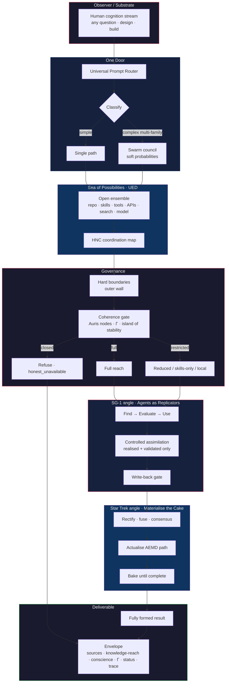

# Two analogies, one problem — the unified replication contract

> Creator's synthesis (Gary Leckey, 2026-08-08). The prose below is the
> creator's own; the measured appendix at the end locks every stage of the
> stated pipeline to code and to benchmark **b61**, which pins the flow
> itself — the comparison "locked to the systems I have designed."

Star Trek and SG-1 are not competing stories. They are two angles on the same engineering problem:

How does an autonomous system
- self-replicate capability,
- self-evolve knowledge,
- and self-design any valid output
from a human cognition stream that can arrive from any probability path?

| Angle | Star Trek Replicator | SG-1 Replicators |
|-------|----------------------|------------------|
| Core act | Materialise one coherent object from a vast pattern space | Distributed agents that assimilate, assemble, and expand |
| Sea of possibilities | Molecular / pattern buffer | Unrealised configurations the collective can absorb |
| Selection | Constraints + energy + pattern integrity | Queen signal + collective coherence |
| Output | Fully formed object (the "cake") | New units, new knowledge, new forms |
| Failure mode | Incomplete or corrupted replication | Uncontrolled expansion without gates |
| Governance | Physics + safety interlocks | Hive field (or chaos if the field is ignored) |

Same issue. Different zoom levels.

---

## The unified problem in your terms

When an observer on the substrate issues a request, the system must:

1. Open a **superposition of relevant possibilities** (UED — unrealised ensemble of directions).
2. Coordinate across knowledge sources via the **HNC map** (grounding, tools, skills, search, swarm).
3. **Rectify** — keep only what is coherent, validated, and realised.
4. **Actualise** one fully formed result (AEMD path) under coherence gates and hard boundaries.
5. Deliver it with envelope: sources, knowledge-reach, conscience, status.

That is self-replication of capability, self-evolution of knowledge, and self-design of the required artefact — answer, plan, code, design spec, or system — from any input the observer can put into the stream.

---

## How the two angles map onto Aureon / HNC

**Star Trek side (the cake)**
- One door → classify → open the sea
- Ground + acquire under control
- Bake until complete
- Envelope and release only the fully formed result

This is the **materialisation contract**: the user never sees the sea; they only receive what survived selection.

**SG-1 side (the agents)**
- Agents are the replicators
- Clusters and soft probabilities, not single ownership
- Coherence gate (Auris / Γ / field) opens or restricts reach
- Queen + hard boundaries + controlled write-back
- Assimilate only what was realised and validated

This is the **hive contract**: no individual unit self-authorises; the field does.

Together they give you:

```
Observer input
  → one door
  → superposition of possibilities (HNC-coordinated)
  → agents acquire / evaluate / use under coherence aperture
  → rectify and fuse
  → actualise only the coherent path
  → fully formed result + envelope
```

---

## What "any probability / timeline" means operationally

Not literal omniscience across a physical multiverse. Operationally it means:

- Local knowledge (repo, skills, model)
- Acquired knowledge (tools, APIs, search, open source) under the Borg-style controlled path
- Soft exploration across agent clusters when the prompt is complex
- Steering by measured field state (Γ, Auris nodes, island of stability) rather than hard-coded single-path logic

The system does not claim to "see all timelines." It claims to **open a controlled ensemble of relevant possibilities**, coordinate them through HNC, and collapse to one coherent, labeled deliverable.

---

## Bottom line

- **Star Trek** = the replicator that only releases a complete cake.
- **SG-1** = the agent swarm that finds and assimilates under hive coherence.
- **HNC / Auris** = the physics that joins them: Master Formula field, dual-voice and Γ, named nodes, controlled acquisition, envelope.

One issue. Two angles. One architecture: observer asks → superposition under HNC coordination → rectify → fully formed result.

---

## Design flow — Aureon OS as dual-angle replicator



### How to read it

| Stage | Angle | Role |
|-------|--------|------|
| One door + classify | Shared | Every input enters the same membrane |
| Sea of possibilities | Shared | Superposition of relevant knowledge paths |
| Hard boundaries + coherence gate | SG-1 + HNC | Outer wall + living hive aperture |
| Find → evaluate → use + write-back | SG-1 | Agents assimilate under control |
| Rectify → actualise → bake | Star Trek | Only the complete cake leaves |
| Envelope | Shared | Provenance, reach, conscience, status |

**One issue.**
**Two angles.**
**One flow:** observer asks → open ensemble under HNC → gate by field → acquire under control → collapse to fully formed result.

---

<!-- editorial: everything below this line is the measured verification appendix,
     added by the maintainers. The prose above is the creator's own. -->

> **Measured-order note (b61):** the built system is *stricter* than the
> diagram reads left-to-right. In the measured traversal the hard boundary
> fires **before everything** (the wall turn runs zero pipeline stages
> before refusing) and the coherence aperture is set **before** grounding
> opens the sea — governance precedes possibility. The diagram's
> conceptual grouping is unchanged; the enforcement order on the wire is
> `wall → route → gate → sea → …`, pinned per run.

## Appendix — the flow itself is machine-checked (b61)

The pieces of both contracts were already pinned separately (b53–b60). Benchmark
**b61** pins the FLOW: every stage of the stated pipeline is wrapped on a real
cognition instance and the traversal order is measured on every turn shape.

| Stated stage | Code | Pinned by |
|---|---|---|
| One door (no LLM bypass) | operator/cognition routes; route audit re-proven from source | b53 |
| Classify → open the sea | `prompt_router.classify_prompt` + `swarm_council` (complex = ≥2 families) | b53, b61 |
| Superposition (UED) → survivor (AEMD) | `_actualize` Film-Reel ledger: realized vs `parked_possibilities` | b54, b61 |
| Agents acquire under coherence aperture | `coherence_gate.compute_aperture` + `GuardedToolRegistry`; `acquisition.py` controlled pass | b57, b58 |
| Rectify (keep only coherent + validated) | `bake.assess_completeness` + Queen `_veto` — both strictly before actualisation | b56, b61 |
| Actualise only the coherent path | `_actualize` after bake+veto; write-back gated realized+approved+complete+ok | b54, b57 |
| Fully formed result + envelope | `CognitionResult.envelope()` — sources, reach, gate, conscience, heart, trace | b53–b60 |

**Measured traversal (b61), every run:**

- ok turn: `route → gate_aperture → ground → run_loop → acquire → bake → veto → actualize → assimilate → heart` — exactly, deterministically
- hard-boundary turn: `actualize → assimilate → heart` with **zero model calls** — the outer wall precedes everything
- field refusal: `route → gate_aperture → actualize → assimilate → heart` with zero model calls — **no individual unit self-authorises; the field does**
- the complex ask convened the council (lead measured); the simple ask did not — superposition opens only when the stream calls for it
- under a soft field the sea stayed on the ledger (`web_search` parked, named) and only the survivor reached the text — **the user never sees the sea**

Both contracts are facets of the same measured path. The comparison is locked.
