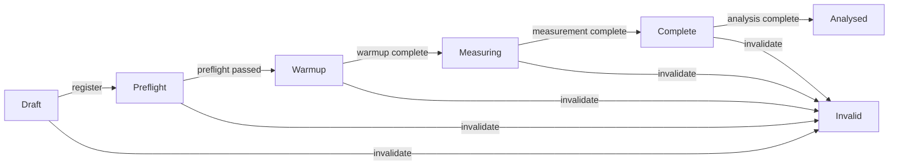

# Aureon Bluetooth Battery Formal Evidence Protocol

## Purpose

This protocol converts the April 2026 laptop Bluetooth battery observations into a controlled, falsifiable research system. It preserves the original files as exploratory evidence and introduces the controls required before a causal statement is made.

The current evidence decision is **inconclusive**. The repository contains favorable, unfavorable, and null observations. It does not currently establish that Bluetooth reduces battery drain, extracts energy, or produces a zero-point effect.

## Existing evidence boundary

The legacy corpus contains 19 JSON files under `data/experiments/zpe` plus the Windows battery monitor and BLE publisher code.

Key comparisons point in different directions:

- `zpe_zero_observer.json`: baseline fell 6 percentage points and the later BLE segment fell 5 points over nominal 15-minute segments. This is one fixed-order comparison at whole-percentage resolution.
- `zpe_30min_test.json`: baseline fell 4 points and the BLE segment fell 6 points over nominal 15-minute segments. This points in the opposite direction and contains negative transition intervals.
- `zpe_persistent_bt.json`: three idle transition intervals and two BLE intervals imply a lower apparent drain rate with BLE, but the sample is small and not randomized.
- `zpe_bt_only_test.json`, `zpe_surround_v2.json`, and `zpe_coupling_test.json` show equal or higher drain under treatment.
- `zpe_bt_v2_test.json` and `zpe_bt_transmit.json` show no coarse-percent difference.

These are legitimate observations, but they are not a controlled causal estimate.

## Physical variable definition

The value `12.669206...` is encoded by the current code inside BLE manufacturer data. Encoding a floating-point number in an advertisement payload does not itself demonstrate that the transmitter is physically modulated at that cadence. The operating system controls BLE advertising behavior unless the experiment measures and verifies the actual advertisement timing.

The formal protocol therefore records these as separate variables:

- **Payload frequency label:** the number encoded in the manufacturer data.
- **Measured advertisement rate:** packet cadence measured independently from the publisher process.
- **RF carrier and transmit power:** standard BLE radio characteristics, recorded when the adapter exposes them.
- **Battery response:** the dependent variable, measured as the slope of remaining battery energy in mWh over time.

## Pre-registered hypothesis

> A controlled BLE treatment changes mean laptop battery discharge power relative to matched baseline and sham segments.

The hypothesis is two-sided. Reduced drain, increased drain, no measurable effect, invalid data, and insufficient evidence are all allowed outcomes.

The primary metric is mean discharge power derived from the linear slope of high-resolution remaining battery energy:

```text
P_discharge (mW) = -3600 * slope(remaining_mWh versus elapsed_seconds)
```

For each randomized block:

```text
P_control = mean(P_baseline, P_sham)
effect_mW = P_control - P_active
relative_effect_pct = 100 * effect_mW / P_control
```

A positive effect means the active arm drained less power. A negative effect means it drained more.

## Experimental arms

Each block contains all arms in a seeded random order:

1. **Baseline:** Bluetooth treatment publisher disabled.
2. **BLE active:** registered payload and measured active advertisement cadence.
3. **Sham:** same radio duty-cycle target and software workload, but a pre-registered control payload that does not contain the target label.

The sham is essential because Bluetooth transmission consumes power. Comparing active BLE only with radio-off baseline cannot distinguish payload-specific behavior from normal radio cost.

## State machine



No stage can be skipped. An invalidated run remains in the evidence archive but cannot contribute to the primary estimate.

## Default protocol

- Segment duration: 30 minutes.
- Warmup: 5 minutes before each measured segment.
- Washout: 5 minutes between segments.
- Sampling: 1 Hz, with at least 1,500 valid samples per segment.
- Blocks: at least 10 complete baseline/active/sham blocks.
- Replication: at least 3 devices and 2 independent operators before a causal claim is allowed.
- Practical effect threshold: 5% relative change in discharge power.
- Analysis: paired block effects with a two-sided 95% confidence interval.

The schedule is generated before measurement by `generate_block_schedule`; its seed is hashed into the protocol manifest.

## Required telemetry

Every sample records:

- monotonic elapsed time;
- remaining battery energy in mWh;
- instantaneous battery rate in mW when available;
- whole or fractional battery percentage as a secondary field;
- AC power state;
- CPU utilization;
- temperature when available;
- BLE active state; and
- cumulative advertisement count.

Every run also records the device ID, independent operator ID, reproducible workload hash, power mode, display brightness, randomization ID, sequence position, payload label, measured advertisement cadence, and analyst blinding state.

## Quality gates

A run is excluded from the primary analysis when any of these conditions is true:

- AC power is observed;
- high-resolution mWh data is missing;
- timestamps are not strictly increasing;
- duration or sample coverage is below the registered minimum;
- workload, power mode, brightness, device, or randomization evidence is missing;
- baseline has material BLE activity;
- active or sham radio activity is below 95%;
- the active arm lacks measured advertisement cadence;
- advertisement counts decrease;
- mean CPU load differs by more than 5 percentage points within a block; or
- mean measured temperature differs by more than 2 C within a block.

Missing temperature telemetry is recorded as a warning because some laptop firmware does not expose it. The analysis still reports that limitation.

## Decision rule

The system reports `inconclusive` until the minimum number of complete blocks passes all gates.

After that threshold:

- `ble_reduced_drain`: the entire 95% interval is above zero and the mean relative effect is at least +5%.
- `ble_increased_drain`: the entire 95% interval is below zero and the mean relative effect is at most -5%.
- `no_measurable_effect`: the interval crosses zero or the practical threshold is not reached.
- `invalid`: the protocol cannot produce analysable blocks because required evidence failed.

Even a directional single-device result remains `controlled_single_device`. `causal_claim_allowed` becomes true only after the multi-device and independent-operator replication thresholds are met.

## Implementation

The executable logic is in `aureon/monitors/aureon_bluetooth_battery_logic.py`.

It provides:

- `ExperimentController` for lifecycle enforcement;
- `validate_run` for deterministic quality gates;
- `derive_run_metric` for mWh-slope power estimation;
- `analyse_experiment` for paired block decisions;
- `generate_block_schedule` and `protocol_manifest` for pre-registration; and
- `audit_legacy_directory` for read-only classification of the original JSON evidence.

The legacy audit hashes every input file and does not modify the source observations.
